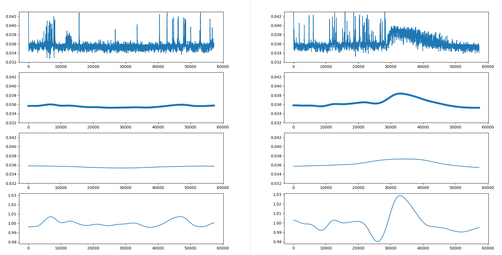

# 2024-space-apps-challenge

## Info

We used resources from the seismic detection across the solar system challenge [here](https://www.spaceappschallenge.org/nasa-space-apps-2024/challenges/seismic-detection-across-the-solar-system/?tab=resources)

To make our data a bit more useful we did a bandpass filter with scipy. Then we implemented a max pooling filter as well.
We then impemented MHE on the data, assuming the system can be modeled as a dampened string with external forces.
Heres a graph showing the force correctly spike when theres a quake, and stay low when there isnt.

## Running the program

### Dependencies

To install dependencies run `pip install -r requirements.txt`

To add a dependency add it as a line into `requirements.in`. Then run `pip install -r requirements.in`.
Once you do that you need to update `requirements.txt` you can do that by doing `pip freeze > requirements.txt`

### Setup

As setup you will need to download the NASA Seismic Detection Across the Solar System dataset found [here](https://wufs.wustl.edu/SpaceApps/data/space_apps_2024_seismic_detection.zip)

Unzip this folder into `./data`

### Running the code

There are a few proesses you can run to see the implementation of this. `src/mhe_test*.py`, `src/mhe_multi_thread.py`.

The parameters these files run under are defined in their code.

Each of these files use the implementation found in `mhe.py`.
