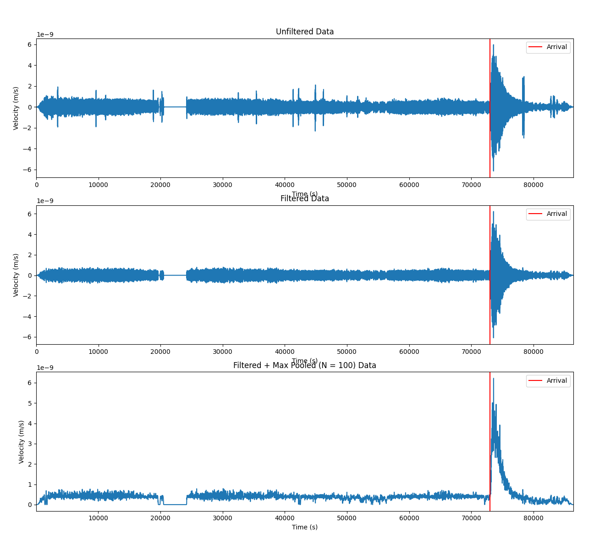

# 2024-space-apps-challenge

## Info

We used resources from the seismic detection across the solar system challenge [here](https://www.spaceappschallenge.org/nasa-space-apps-2024/challenges/seismic-detection-across-the-solar-system/?tab=resources)

To make our data a bit more useful we did a bandpass filter with scipy. Then we implemented a max pooling filter as well.
This graph shows the progression from the raw to filtered data.

## Dependencies

To install dependencies run `pip install -r requirements.txt`

To add a dependency add it as a line into `requirements.in`. Then run `pip install -r requirements.in`.
Once you do that you need to update `requirements.txt` you can do that by doing `pip freeze > requirements.txt`
